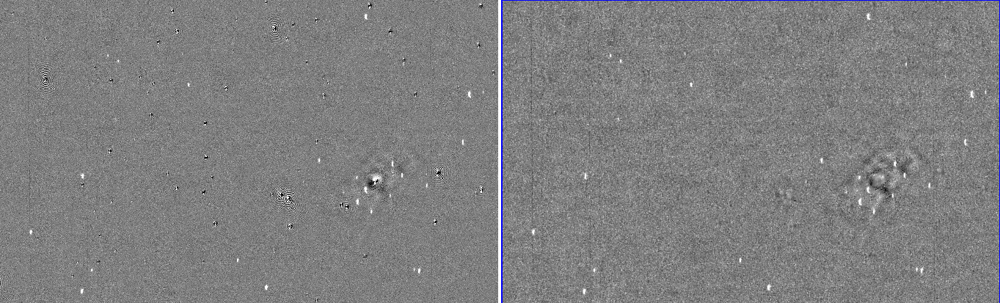

ZOGY in Parallel
================

*A python package for image subtraction, registration, and co-addition*

How to install
---------------

ZiP can be installed with `pip <https://pip.pypa.io>`_  ::

    pip install zogyp

Dependancies
    #. `numpy <https://numpy.org/>`_
    #. `scipy <https://www.scipy.org/>`_
    #. `astropy <https://www.astropy.org/>`_
    #. `sep <https://sep.readthedocs.io/en/v1.0.x/>`_
    #. `SExtractor <https://www.astromatic.net/software/sextractor>`_
    #. `PSFex <https://www.astromatic.net/software/psfex>`_
About
-----

ZOGY in Parallell (ZiP) is a fast(ish) computation of proper image subtraction  `B.Zackay, E.Ofek, A.Gal-Yam (2016) <http://iopscience.iop.org/article/10.3847/0004-637X/830/1/27/pdf>`_. Inspired by  `Ofek (2014) <http://adsabs.harvard.edu/abs/2014ascl.soft07005O>`_ and `pmvreeswijk <https://github.com/pmvreeswijk/ZOGY>`_. ZiP offers a faster subtraction at the expense of a more comprehensive input. I.e. The program should be tailored for one telescope or input of images. This code has a parallell function, however it requires 6+ cores to operate. This particular Case is optimised for the Gravitational-Wave Optical Transient Observer (`GOTO <https://goto-observatory.org>`_) However, simple fudging of the parameters should make it possible to make this work for other telescopes.

    Left: is the D-output image. Right: Scorr image.
 
An internal version of  `Spalipy <https://github.com/GOTO-OBS/spalipy>`_ has been added as the alignment algorithm. This uses sextractor to find source locations in two images and then aligns them with an affine transform. Residuals are then used to build a 2D spline surface to correct for warping due to large field distortions.

Finally, a parallel version of  `proper coadition <https://arxiv.org/abs/1512.06879>`_ is used for stacking images. It still isn't increadibly fast for on the spot coaddition; so a meidian combine tool is also included.

Basic Usage 
-----------

**At the moment ZiP cannot be used in the terminal** ::

    import zogyp
    
    zogyp.zip.run_ZOGY(sci,ref)

This will do the subtraction (sci - ref) and return the subtracted in an output directory. 

The output consists of the D_image, S_image, and Scorr_image. 

There is a comprehensive `tutorial on GitHub <https://github.com/GOTO-OBS/ZiP/tree/ZiP4Pipeline/Tutorial>`_ 

::

    Ry Cutter 
    
    Version 1.4.7 (29/04/2019)
    

