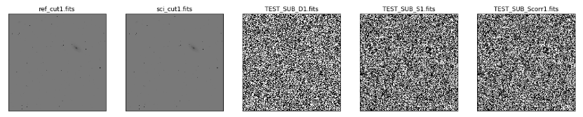
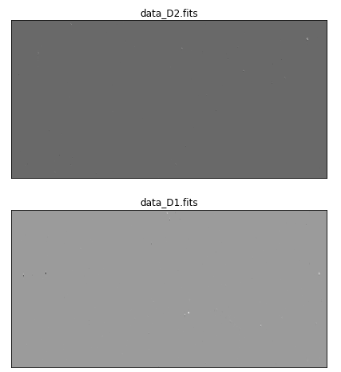

ZOGY
====

*This is the subtraction code, below describes the algorithm and how to use it*

The Maths
---------

DO MATHS

.. math::
   
   \widehat{D} = \frac{p}{\sqrt{V}}
   
   
As described in  `B.Zackay, E.Ofek, A.Gal-Yam (2016) <http://iopscience.iop.org/article/10.3847/0004-637X/830/1/27/pdf>`_.

Running ZOGY Tutorial
---------------------

Install the standards ::
    
        import glob
        import ntpath
        import time
        import shutil 
        import matplotlib.pyplot as plt
        from astropy.io import fits
        import numpy as np

        #ZOGY in Parallel routines
        from zogyp.zip import run_ZOGY
        from zogyp.zip import rdfits
        from zogyp.zip import config_loc

        #Image alignment
        #from zogyp.spali2 import spalipy

        #Stacking
        #from zogyp.zo_coadd import med_comb
        #from zogyp.zo_coadd import prop_coad
      
**Find the directory of the configuration files, these will need to be edited for best peformance** ::

       print(config_loc())
The two files of interest are default.sex and psfex.conf

Get the test images :: 

    t_f = LOC.replace('configfls','test')
    T = [i for i in glob.glob(t_f+'/*')]
    
Basic Subtraction :: 

   run_ZOGY(T[0], T[1], outname='TEST_SUB') #ZOGY image subtraction T[0] - T[1]
   
Let's plot the subtractions ::

   file_names = glob.glob('Zoutput/*')
   fig, axs = plt.subplots(1, 5, figsize=(20,45))
   for i in range(len(file_names)):
       D = fits.getdata(file_names[i])
       axs[i].imshow(D, cmap = 'gray_r', vmin = -np.mean(D)*20, vmax= np.mean(D)*20)
       axs[i].set_xticks([] , [])
       axs[i].set_yticks([] , [])
       axs[i].set_title(ntpath.basename(file_names[i]))
   plt.show()
   

**ZiP is a fast image subtraction tool. If speed is a vital component for your subtraction, pay attention to the clean_ref and clean_sci parameters. They exist to clean up small order over fitting of the PSF from PSFex. The smaller the parameter the faster the subtraction, (usually 0.25 should suffice). As this is on a normalised PSF, the cleaning parameter has to be between 0 and 1 and will remove any pixel values in the kernel smaller than the cleaning param** :: 

    Array = []
    PLOTS = []
    for i in range(11):
        t = time.time()
        X = i/10
        run_ZOGY(T[0], T[1], clean_ref = X, clean_sci = X)
        Array.append([X, (time.time() - t)])
        plt.imshow(fits.getdata('Zoutput/data_D1.fits')[630:690, 1254:1300])
        plt.xticks([], [])
        plt.yticks([], [])
        plt.
        show()
        
**Use PSF slices to do subtractions even faster. Slices are used primarily to apply a varrying PSF across the field. This can be done in parallel and the slices are smaller which speeds up the subtraction** :: 

    run_ZOGY(T[0], T[1], xslice=2, yslice=2)

**Sub images (not to be confused with the PSF slices from above) split the main image. These sub images can be subtracted simultaneously, and is the backbone of what makes ZiP so fast. These output images should be treated as seperate (independant images) when doing analyses.** :: 

   run_ZOGY(T[0], T[1], sub_imagex=1, sub_imagey=2)

Plot the sub-images :: 
   
   file_names = glob.glob('Zoutput/data_D*')
   fig, axs = plt.subplots(2, 1, figsize=(10,8))
   for i in range(len(file_names)):
       D = fits.getdata(file_names[i])
       axs[i].imshow(D, cmap='gray')
       axs[i].set_xticks([] , [])
       axs[i].set_yticks([] , [])
       axs[i].set_title(ntpath.basename(file_names[i]))
   plt.show()

Finally, put it all together! :: 

    run_ZOGY(T[0], T[1], sub_imagex=1, sub_imagey=2,
             xslice=2, yslice=2, blackout=True,
             clean_ref = 0.75, clean_sci = 0.75,
             outname = 'FINAL')

    plt.imshow(fits.getdata('Zoutput/FINAL_Scorr1.fits'), cmap='gray_r' ,vmin=-0.25, vmax=0.25)
    plt.xticks([],[])
    plt.yticks([],[])
    plt.show()
    
.. figure::
   Plot3.PNG

Parameters
----------

.. list-table:: Title
   :widths: 25 25 25
   :header-rows: 1

   * - Parameter
     - Purpose
     - Range
   * - sub_imagex
     - Number of sub-images from slices on the x-axis
     - >0
   * - sub_imagey
     - Number of sub-images from slices on the y-axis
     - >0
   * - xslice
     - PSF kernels built for each sub-image x-axis
     - >0
   * - yslice
     - PSF kernels built for each sub-image y-axis
     - >0
   * - blackout
     - Clears any part of the reference image that does not overlap with the science image
     - True / False
   * - clean_sci 
     - cleans the science PSF kernel, anything less than the param = 0
     - 0<, <1
   * - clean_ref 
     - cleans the reference PSF kernel, anything less than the param = 0
     - 0<, <1
   * - outname 
     - Name for the output files
     - str
   * - align 
     - If true, will align the science image to the reference
     - True / False 
     
     
     
Tips and Tricks
---------------

To Do

